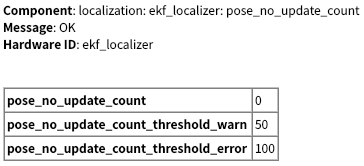

# Overview

The **Extend Kalman Filter Localizer** estimates robust and less noisy robot pose and twist by integrating the 2D vehicle dynamics model with input ego-pose and ego-twist messages. The algorithm is designed especially for fast-moving robots such as autonomous driving systems.

## Flowchart

The overall flowchart of the autoware_ekf_localizer is described below.

  

## Features

This package includes the following features:

- **Time delay compensation** for input messages, which enables proper integration of input information with varying time delays. This is important especially for high-speed moving robots, such as autonomous driving vehicles. (see the following figure).
- **Automatic estimation of yaw bias** prevents modeling errors caused by sensor mounting angle errors, which can improve estimation accuracy.
- **Mahalanobis distance gate** enables probabilistic outlier detection to determine which inputs should be used or ignored.
- **Smooth update**, the Kalman Filter measurement update is typically performed when a measurement is obtained, but it can cause large changes in the estimated value, especially for low-frequency measurements. Since the algorithm can consider the measurement time, the measurement data can be divided into multiple pieces and integrated smoothly while maintaining consistency (see the following figure).
- **Calculation of vertical correction amount from pitch** mitigates localization instability on slopes. For example, when going uphill, it behaves as if it is buried in the ground (see the left side of the "Calculate delta from pitch" figure) because EKF only considers 3DoF(x,y,yaw). Therefore, EKF corrects the z-coordinate according to the formula (see the right side of the "Calculate delta from pitch" figure).

  

  

## Node

### Subscribed Topics

| Name                             | Type                                             | Description                                                                                                                              |
| -------------------------------- | ------------------------------------------------ | ---------------------------------------------------------------------------------------------------------------------------------------- |
| `measured_pose_with_covariance`  | `geometry_msgs::msg::PoseWithCovarianceStamped`  | Input pose source with the measurement covariance matrix.                                                                                |
| `measured_twist_with_covariance` | `geometry_msgs::msg::TwistWithCovarianceStamped` | Input twist source with the measurement covariance matrix.                                                                               |
| `initialpose`                    | `geometry_msgs::msg::PoseWithCovarianceStamped`  | Initial pose for EKF. The estimated pose is initialized with zeros at the start. It is initialized with this message whenever published. |

### Published Topics

| Name                              | Type                                                | Description                                           |
| --------------------------------- | --------------------------------------------------- | ----------------------------------------------------- |
| `ekf_odom`                        | `nav_msgs::msg::Odometry`                           | Estimated odometry.                                   |
| `ekf_pose`                        | `geometry_msgs::msg::PoseStamped`                   | Estimated pose.                                       |
| `ekf_pose_with_covariance`        | `geometry_msgs::msg::PoseWithCovarianceStamped`     | Estimated pose with covariance.                       |
| `ekf_biased_pose`                 | `geometry_msgs::msg::PoseStamped`                   | Estimated pose including the yaw bias                 |
| `ekf_biased_pose_with_covariance` | `geometry_msgs::msg::PoseWithCovarianceStamped`     | Estimated pose with covariance including the yaw bias |
| `ekf_twist`                       | `geometry_msgs::msg::TwistStamped`                  | Estimated twist.                                      |
| `ekf_twist_with_covariance`       | `geometry_msgs::msg::TwistWithCovarianceStamped`    | The estimated twist with covariance.                  |
| `diagnostics`                     | `diagnostics_msgs::msg::DiagnosticArray`            | The diagnostic information.                           |
| `debug/processing_time_ms`        | `autoware_internal_debug_msgs::msg::Float64Stamped` | The processing time [ms].                             |

### Published TF

- base_link
  TF from `map` coordinate to estimated pose.

## Functions

### Predict

The current robot state is predicted from previously estimated data using a given prediction model. This calculation is called at a constant interval (`predict_frequency [Hz]`). The prediction equation is described at the end of this page.

### Measurement Update

Before the update, the Mahalanobis distance is calculated between the measured input and the predicted state, the measurement update is not performed for inputs where the Mahalanobis distance exceeds the given threshold.

The predicted state is updated with the latest measured inputs, measured_pose, and measured_twist. The updates are performed with the same frequency as prediction, usually at a high frequency, in order to enable smooth state estimation.

## Parameter description

The parameters are set in `launch/ekf_localizer.launch` .

### For Node

{{ json_to_markdown("localization/autoware_ekf_localizer/schema/sub/node.sub_schema.json") }}

### For pose measurement

{{ json_to_markdown("localization/autoware_ekf_localizer/schema/sub/pose_measurement.sub_schema.json") }}

### For twist measurement

{{ json_to_markdown("localization/autoware_ekf_localizer/schema/sub/twist_measurement.sub_schema.json") }}

### For process noise

{{ json_to_markdown("localization/autoware_ekf_localizer/schema/sub/process_noise.sub_schema.json") }}

note: process noise for positions x & y are calculated automatically from nonlinear dynamics.

### Simple 1D Filter Parameters

{{ json_to_markdown("localization/autoware_ekf_localizer/schema/sub/simple_1d_filter_parameters.sub_schema.json") }}

### For diagnostics

{{ json_to_markdown("localization/autoware_ekf_localizer/schema/sub/diagnostics.sub_schema.json") }}

### Misc

{{ json_to_markdown("localization/autoware_ekf_localizer/schema/sub/misc.sub_schema.json") }}

## How to tune EKF parameters

### 0. Preliminaries

- Check header time in pose and twist message is set to sensor time appropriately, because time delay is calculated from this value. If it is difficult to set an appropriate time due to the timer synchronization problem, use `twist_additional_delay` and `pose_additional_delay` to correct the time.
- Check if the relation between measurement pose and twist is appropriate (whether the derivative of the pose has a similar value to twist). This discrepancy is caused mainly by unit error (such as confusing radian/degree) or bias noise, and it causes large estimation errors.

### 1. Tune sensor parameters

Set standard deviation for each sensor. The `pose_measure_uncertainty_time` is for the uncertainty of the header timestamp data.
You can also tune a number of steps for smoothing for each observed sensor data by tuning `*_smoothing_steps`.
Increasing the number will improve the smoothness of the estimation, but may have an adverse effect on the estimation performance.

- `pose_measure_uncertainty_time`
- `pose_smoothing_steps`
- `twist_smoothing_steps`

### 2. Tune process model parameters

- `proc_stddev_vx_c` : set to maximum linear acceleration
- `proc_stddev_wz_c` : set to maximum angular acceleration
- `proc_stddev_yaw_c` : This parameter describes the correlation between the yaw and yaw rate. A large value means the change in yaw does not correlate to the estimated yaw rate. If this is set to 0, it means the change in estimated yaw is equal to yaw rate. Usually, this should be set to 0.
- `proc_stddev_yaw_bias_c` : This parameter is the standard deviation for the rate of change in yaw bias. In most cases, yaw bias is constant, so it can be very small, but must be non-zero.

### 3. Tune gate parameters

EKF performs gating using Mahalanobis distance before updating by observation. The gate size is determined by the `pose_gate_dist` parameter and the `twist_gate_dist`. If the Mahalanobis distance is larger than this value, the observation is ignored.

This gating process is based on a statistical test using the chi-square distribution. As modeled, we assume that the Mahalanobis distance follows a chi-square distribution with 3 degrees of freedom for pose and 2 degrees of freedom for twist.

Currently, the accuracy of covariance estimation itself is not very good, so it is recommended to set the significance level to a very small value to reduce rejection due to false positives.

| Significance level | Threshold for 2 dof | Threshold for 3 dof |
| ------------------ | ------------------- | ------------------- |
| $10 ^ {-2}$        | 9.21                | 11.3                |
| $10 ^ {-3}$        | 13.8                | 16.3                |
| $10 ^ {-4}$        | 18.4                | 21.1                |
| $10 ^ {-5}$        | 23.0                | 25.9                |
| $10 ^ {-6}$        | 27.6                | 30.7                |
| $10 ^ {-7}$        | 32.2                | 35.4                |
| $10 ^ {-8}$        | 36.8                | 40.1                |
| $10 ^ {-9}$        | 41.4                | 44.8                |
| $10 ^ {-10}$       | 46.1                | 49.5                |

## Kalman Filter Model

### kinematics model in update function

where, $\theta_k$ represents the vehicle's heading angle, including the mounting angle bias.
$b_k$ is a correction term for the yaw bias, and it is modeled so that $(\theta_k+b_k)$ becomes the heading angle of the base_link.
The pose_estimator is expected to publish the base_link in the map coordinate system. However, the yaw angle may be offset due to calibration errors. This model compensates this error and improves estimation accuracy.

### time delay model

The measurement time delay is handled by an augmented state [1] (See, Section 7.3 FIXED-LAG SMOOTHING).

Note that, although the dimension gets larger since the analytical expansion can be applied based on the specific structures of the augmented states, the computational complexity does not significantly change.

## Test Result with Autoware NDT

## Diagnostics

### is_activated

| Name           | Description                      | Transition condition to Warning | Transition condition to Error |
| -------------- | -------------------------------- | ------------------------------- | ----------------------------- |
| `is_activated` | The activation state of the node | The node is not in the activate state | none |

### is_set_initialpose

| Name                | Description                         | Transition condition to Warning | Transition condition to Error |
| ------------------- | ----------------------------------- | ------------------------------- | ----------------------------- |
| `is_set_initialpose` | Whether the initial pose is set | The initial pose is not set | none |

### pose_no_update_count

| Name                                   | Description                                           | Transition condition to Warning | Transition condition to Error |
| -------------------------------------- | ----------------------------------------------------- | ------------------------------- | ----------------------------- |
| `pose_no_update_count`                 | Consecutive count of no measurement update via Pose topic | The count exceeds `pose_no_update_count_threshold_warn` | The count exceeds `pose_no_update_count_threshold_error` |
| `pose_no_update_count_threshold_warn`  | Warning threshold for pose update count               | none | none |
| `pose_no_update_count_threshold_error` | Error threshold for pose update count                 | none | none |

### pose_queue_size

| Name              | Description                    | Transition condition to Warning | Transition condition to Error |
| ----------------- | ------------------------------ | ------------------------------- | ----------------------------- |
| `pose_queue_size` | Current size of the pose queue | none | none |

### pose_delay_time

| Name                         | Description                                  | Transition condition to Warning | Transition condition to Error |
| ---------------------------- | -------------------------------------------- | ------------------------------- | ----------------------------- |
| `pose_is_passed_delay_gate`  | Whether the Pose topic passes the delay gate | The timestamp is beyond the delay compensation range | none |
| `pose_delay_time`            | Current delay time of Pose topic            | none | none |
| `pose_delay_time_threshold`  | Threshold for pose delay time                | none | none |

### pose_mahalanobis_distance

| Name                               | Description                                              | Transition condition to Warning | Transition condition to Error |
| ---------------------------------- | -------------------------------------------------------- | ------------------------------- | ----------------------------- |
| `pose_is_passed_mahalanobis_gate`  | Whether the Pose topic passes the Mahalanobis distance gate | The Pose topic is beyond the range of Mahalanobis distance for covariance estimation | none |
| `pose_mahalanobis_distance`        | Current Mahalanobis distance for Pose topic             | none | none |
| `pose_mahalanobis_distance_threshold` | Threshold for pose Mahalanobis distance              | none | none |

### twist_no_update_count

| Name                                    | Description                                            | Transition condition to Warning | Transition condition to Error |
| --------------------------------------- | ------------------------------------------------------ | ------------------------------- | ----------------------------- |
| `twist_no_update_count`                 | Consecutive count of no measurement update via Twist topic | The count exceeds `twist_no_update_count_threshold_warn` | The count exceeds `twist_no_update_count_threshold_error` |
| `twist_no_update_count_threshold_warn`  | Warning threshold for twist update count               | none | none |
| `twist_no_update_count_threshold_error` | Error threshold for twist update count                 | none | none |

### twist_queue_size

| Name               | Description                     | Transition condition to Warning | Transition condition to Error |
| ------------------ | ------------------------------- | ------------------------------- | ----------------------------- |
| `twist_queue_size` | Current size of the twist queue | none | none |

### twist_delay_time

| Name                          | Description                                   | Transition condition to Warning | Transition condition to Error |
| ----------------------------- | --------------------------------------------- | ------------------------------- | ----------------------------- |
| `twist_is_passed_delay_gate`  | Whether the Twist topic passes the delay gate | The timestamp is beyond the delay compensation range | none |
| `twist_delay_time`            | Current delay time of Twist topic            | none | none |
| `twist_delay_time_threshold`  | Threshold for twist delay time                | none | none |

### twist_mahalanobis_distance

| Name                                | Description                                               | Transition condition to Warning | Transition condition to Error |
| ----------------------------------- | --------------------------------------------------------- | ------------------------------- | ----------------------------- |
| `twist_is_passed_mahalanobis_gate`  | Whether the Twist topic passes the Mahalanobis distance gate | The Twist topic is beyond the range of Mahalanobis distance for covariance estimation | none |
| `twist_mahalanobis_distance`        | Current Mahalanobis distance for Twist topic             | none | none |
| `twist_mahalanobis_distance_threshold` | Threshold for twist Mahalanobis distance              | none | none |

### cov_ellipse_long_axis_size

| Name                                 | Description                                | Transition condition to Warning | Transition condition to Error |
| ------------------------------------ | ------------------------------------------ | ------------------------------- | ----------------------------- |
| `cov_ellipse_long_axis_size`         | Size of the covariance ellipse (long axis) | The ellipse is bigger than `warn_ellipse_size` | The ellipse is bigger than `error_ellipse_size` |
| `cov_ellipse_long_axis_warn_threshold` | Warning threshold for long axis ellipse size | none | none |
| `cov_ellipse_long_axis_error_threshold` | Error threshold for long axis ellipse size | none | none |

### cov_ellipse_lateral_direction_size

| Name                                           | Description                                         | Transition condition to Warning | Transition condition to Error |
| ---------------------------------------------- | --------------------------------------------------- | ------------------------------- | ----------------------------- |
| `cov_ellipse_lateral_direction_size`           | Size of the covariance ellipse (lateral direction) | The ellipse is bigger than `warn_ellipse_size_lateral_direction` | The ellipse is bigger than `error_ellipse_size_lateral_direction` |
| `cov_ellipse_lateral_direction_warn_threshold` | Warning threshold for lateral direction ellipse size | none | none |
| `cov_ellipse_lateral_direction_error_threshold` | Error threshold for lateral direction ellipse size | none | none |

### callback_pose

| Name               | Description                                    | Transition condition to Warning | Transition condition to Error |
| ------------------ | ---------------------------------------------- | ------------------------------- | ----------------------------- |
| `topic_time_stamp` | The time stamp of the pose callback execution | none | none |

※This diagnostic is published every time the pose callback is executed, providing a record of when pose measurements are received.

### callback_twist

| Name               | Description                                     | Transition condition to Warning | Transition condition to Error |
| ------------------ | ----------------------------------------------- | ------------------------------- | ----------------------------- |
| `topic_time_stamp` | The time stamp of the twist callback execution | none | none |

※This diagnostic is published every time the twist callback is executed, providing a record of when twist measurements are received.

## Known issues

- If multiple pose_estimators are used, the input to the EKF will include multiple yaw biases corresponding to each source. However, the current EKF assumes the existence of only one yaw bias. Therefore, yaw bias `b_k` in the current EKF state would not make any sense and cannot correctly handle these multiple yaw biases. Thus, future work includes introducing yaw bias for each sensor with yaw estimation.

## reference

[1] Anderson, B. D. O., & Moore, J. B. (1979). Optimal filtering. Englewood Cliffs, NJ: Prentice-Hall.
