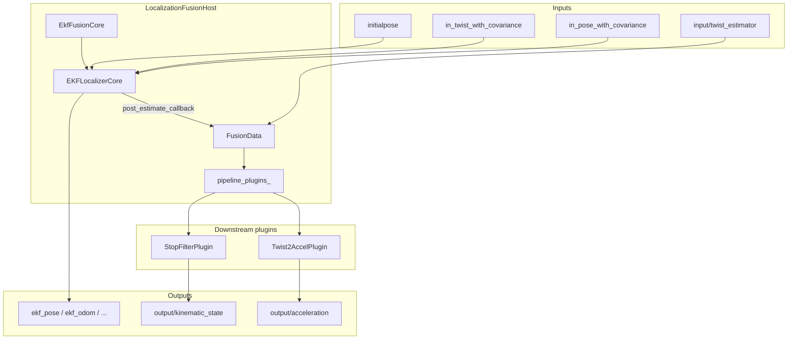

# autoware_localization_fusion_host

## Overview

`autoware_localization_fusion_host` runs the core localization fusion pipeline inside a **single ROS 2 node**. It replaces the separate-node chain of:

- `autoware_ekf_localizer`
- `autoware_stop_filter`
- `autoware_twist2accel`

with one composable node that shares the same parameter namespace and avoids inter-node communication overhead.

The node always runs the EKF (`EkfFusionCore` wrapping `EKFLocalizerCore`). Downstream post-processing stages are loaded dynamically via **pluginlib**.

### Required companion packages

Although this node replaces the **separate ROS nodes**, the current implementation still **depends on these packages being built and installed**:

| Package                  | Required at install time? | Role in fusion host                                                  |
| ------------------------ | ------------------------- | -------------------------------------------------------------------- |
| `autoware_ekf_localizer` | **Yes**                   | Provides `EKFLocalizerCore` (linked into the host component library) |
| `autoware_stop_filter`   | **Yes**                   | Provides `StopFilterProcessor`, used by `StopFilterPlugin`           |
| `autoware_twist2accel`   | **Yes**                   | Provides `Twist2AccelProcessor`, used by `Twist2AccelPlugin`         |

The stop-filter and twist2accel **standalone executables are not launched** by this package. Their logic is reused in-process via the processor libraries shipped by those packages. If `autoware_stop_filter` or `autoware_twist2accel` is missing from the workspace or underlay, `autoware_localization_fusion_host` will not build or run.

These dependencies are declared in `package.xml` and resolved automatically when you build with `--packages-up-to`:

```bash
colcon build --packages-up-to autoware_localization_fusion_host
```

Building only `autoware_localization_fusion_host` in isolation (without the packages above already installed in your underlay) is not supported with the current design.

## Architecture



### Components

| Component                | Role                                                                               |
| ------------------------ | ---------------------------------------------------------------------------------- |
| `LocalizationFusionHost` | ROS 2 node: parameters, plugin loading, pipeline orchestration                     |
| `EkfFusionCore`          | Fixed module that owns `EKFLocalizerCore` and wires the post-estimate callback     |
| `StopFilterPlugin`       | Optional downstream plugin; zeros twist when stopped and publishes kinematic state |
| `Twist2AccelPlugin`      | Optional downstream plugin; estimates acceleration from kinematic state            |

EKF is **not** a plugin. It is constructed directly in the host because it is always required. Only downstream stages are selectable through `plugin_names`.

### Data flow

After each EKF timer cycle, `EKFLocalizerCore` invokes a callback that:

1. Fills `FusionData` with the latest EKF odometry and twist-with-covariance.
2. If `use_stop_filter` is false, copies EKF odometry into `kinematic_state` directly.
3. Runs each loaded downstream plugin in `plugin_names` order via `process(FusionData &)`.

Plugins communicate through the shared `FusionData` struct rather than ROS topics between pipeline stages.

## Launch

```bash
ros2 launch autoware_localization_fusion_host localization_fusion_host.launch.xml
```

The launch file loads two parameter files:

| File                                                     | Content                                                 |
| -------------------------------------------------------- | ------------------------------------------------------- |
| `config/localization_fusion_host.param.yaml`             | Host and downstream plugin parameters                   |
| `autoware_ekf_localizer/config/ekf_localizer.param.yaml` | EKF parameters (measurement noise, process noise, etc.) |

Remapping arguments in `launch/localization_fusion_host.launch.xml` connect this node to the standard Autoware localization topic names (for example `/localization/pose_estimator/pose_with_covariance`).

## Inputs / Outputs

Topic names below are the **node-local names** before launch remapping.

### EKF inputs (via `EKFLocalizerCore`)

| Name                       | Type                                       | Description                     |
| -------------------------- | ------------------------------------------ | ------------------------------- |
| `initialpose`              | `geometry_msgs/PoseWithCovarianceStamped`  | Initial pose for EKF activation |
| `in_pose_with_covariance`  | `geometry_msgs/PoseWithCovarianceStamped`  | Pose measurement                |
| `in_twist_with_covariance` | `geometry_msgs/TwistWithCovarianceStamped` | Twist measurement               |

### Host inputs

| Name                    | Type                                       | Description                                                                        |
| ----------------------- | ------------------------------------------ | ---------------------------------------------------------------------------------- |
| `input/twist_estimator` | `geometry_msgs/TwistWithCovarianceStamped` | Optional twist source for `Twist2AccelPlugin` when `twist2accel.use_odom` is false |

### EKF outputs

| Name                              | Type                                          | Description                                                                            |
| --------------------------------- | --------------------------------------------- | -------------------------------------------------------------------------------------- |
| `ekf_pose`                        | `geometry_msgs/PoseStamped`                   | Estimated pose                                                                         |
| `ekf_pose_with_covariance`        | `geometry_msgs/PoseWithCovarianceStamped`     | Estimated pose with covariance                                                         |
| `ekf_biased_pose`                 | `geometry_msgs/PoseStamped`                   | Pose including yaw bias                                                                |
| `ekf_biased_pose_with_covariance` | `geometry_msgs/PoseWithCovarianceStamped`     | Biased pose with covariance                                                            |
| `ekf_twist`                       | `geometry_msgs/TwistStamped`                  | Estimated twist                                                                        |
| `ekf_twist_with_covariance`       | `geometry_msgs/TwistWithCovarianceStamped`    | Estimated twist with covariance                                                        |
| `ekf_odom`                        | `nav_msgs/Odometry`                           | Estimated odometry (published when stop filter is disabled or debug output is enabled) |
| `estimated_yaw_bias`              | `autoware_internal_debug_msgs/Float64Stamped` | Estimated yaw bias                                                                     |
| `debug/processing_time_ms`        | `autoware_internal_debug_msgs/Float64Stamped` | EKF processing time                                                                    |
| `/diagnostics`                    | `diagnostic_msgs/DiagnosticArray`             | Diagnostic information                                                                 |

EKF also publishes `map` → `base_link` TF. See [autoware_ekf_localizer](../autoware_ekf_localizer/README.md) for algorithm details.

### Downstream plugin outputs

| Name                        | Type                                       | Plugin      | Description                                                    |
| --------------------------- | ------------------------------------------ | ----------- | -------------------------------------------------------------- |
| `output/kinematic_state`    | `nav_msgs/Odometry`                        | StopFilter  | Filtered kinematic state for control/planning                  |
| `debug/stop_flag`           | `autoware_internal_debug_msgs/BoolStamped` | StopFilter  | Whether the vehicle is considered stopped                      |
| `debug/ekf_kinematic_state` | `nav_msgs/Odometry`                        | StopFilter  | Raw EKF odometry (when `publish_intermediate_outputs` is true) |
| `output/acceleration`       | `geometry_msgs/AccelWithCovarianceStamped` | Twist2Accel | Estimated acceleration                                         |

### Services

| Name               | Type               | Description                         |
| ------------------ | ------------------ | ----------------------------------- |
| `trigger_node_srv` | `std_srvs/SetBool` | Activate or deactivate the EKF node |

## Parameters

Parameters are split between the host config and the EKF config. Defaults are in `config/localization_fusion_host.param.yaml`.

### Host parameters

| Name                           | Type     | Default                 | Description                                   |
| ------------------------------ | -------- | ----------------------- | --------------------------------------------- |
| `plugin_names`                 | string[] | StopFilter, Twist2Accel | Downstream plugins to load, in pipeline order |
| `use_stop_filter`              | bool     | `true`                  | Enable stop filter processing                 |
| `use_twist2accel`              | bool     | `true`                  | Enable twist-to-acceleration processing       |
| `publish_intermediate_outputs` | bool     | `false`                 | Publish raw EKF odometry on debug topics      |

### Stop filter parameters

| Name                       | Type   | Default | Description                                              |
| -------------------------- | ------ | ------- | -------------------------------------------------------- |
| `stop_filter.vx_threshold` | double | `0.1`   | Longitudinal velocity threshold for stop detection [m/s] |
| `stop_filter.wz_threshold` | double | `0.02`  | Yaw rate threshold for stop detection [rad/s]            |

### Twist2accel parameters

| Name                             | Type   | Default | Description                                                         |
| -------------------------------- | ------ | ------- | ------------------------------------------------------------------- |
| `twist2accel.use_odom`           | bool   | `true`  | Use kinematic state odometry; if false, use `input/twist_estimator` |
| `twist2accel.accel_lowpass_gain` | double | `0.9`   | Low-pass filter gain for acceleration estimation                    |

### EKF parameters

All EKF parameters (`node.*`, `pose_measurement.*`, `twist_measurement.*`, `process_noise.*`, etc.) are loaded from `autoware_ekf_localizer`'s parameter file. The host config only sets `node.diagnostics_hardware_id` by default.

## Adding a downstream plugin

1. Create a class inheriting `autoware::localization_fusion_host::plugin::LocalizationFusionPluginBase`.
2. Implement `process(FusionData & data)` and optionally `set_up_params()` / `on_parameter()`.
3. Register the class with `PLUGINLIB_EXPORT_CLASS` in the plugin `.cpp` file.
4. Add an entry to `plugins.xml`.
5. Add the source file to the `${PROJECT_NAME}_plugins` library in `CMakeLists.txt`.
6. Add the plugin type string to `plugin_names` in the parameter file.

Do **not** link the plugins library into the component library. pluginlib must load plugins dynamically at runtime.

Example plugin interface:

```cpp
class MyPlugin : public LocalizationFusionPluginBase
{
public:
  void process(FusionData & data) override;
};
```

## Package layout

```text
autoware_localization_fusion_host/
├── config/localization_fusion_host.param.yaml
├── launch/localization_fusion_host.launch.xml
├── plugins.xml
├── src/
│   ├── localization_fusion_host.cpp   # Node entry point
│   ├── ekf_fusion_core.cpp            # Fixed EKF module
│   ├── stop_filter_plugin.cpp
│   ├── twist2accel_plugin.cpp
│   └── include/
│       ├── localization_fusion_host.hpp
│       ├── ekf_fusion_core.hpp
│       ├── localization_fusion_plugin_base.hpp
│       ├── fusion_data.hpp
│       ├── stop_filter_plugin.hpp
│       └── twist2accel_plugin.hpp
└── CMakeLists.txt
```

## Dependencies

This package does **not** vendor stop-filter or twist2accel logic. It links against and ships plugins that wrap processors from the original packages.

| Package                  | Usage                                         | Install required? |
| ------------------------ | --------------------------------------------- | ----------------- |
| `autoware_ekf_localizer` | `EKFLocalizerCore` (EKF algorithm and I/O)    | Yes               |
| `autoware_stop_filter`   | `StopFilterProcessor` in `StopFilterPlugin`   | Yes               |
| `autoware_twist2accel`   | `Twist2AccelProcessor` in `Twist2AccelPlugin` | Yes               |
| `pluginlib`              | Dynamic loading of downstream plugins         | Yes               |

All three localization packages above must be present in the same underlay (or built together in the workspace) before launching this node.

## Build

Use `--packages-up-to` so colcon also builds the companion packages this node links against:

```bash
colcon build --packages-up-to autoware_localization_fusion_host
source install/setup.bash
```

If those dependencies are already installed in your environment, a selective build is also fine:

```bash
colcon build --packages-select autoware_localization_fusion_host
source install/setup.bash
```

## Related packages

- [autoware_ekf_localizer](../autoware_ekf_localizer/README.md) — standalone EKF node and algorithm reference
- [autoware_stop_filter](../autoware_stop_filter/README.md) — standalone stop filter node
- [autoware_twist2accel](../autoware_twist2accel/README.md) — standalone twist-to-acceleration node
