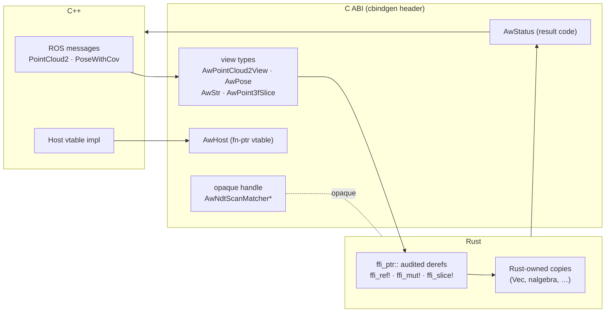

# The FFI boundary

The C ABI between the C++ shell and the Rust crate is hand-rolled (a `cbindgen`-generated header
is the single source of truth) and follows a set of 26 FFI soundness rules. The guiding
principle: **every value, pointer, and struct crossing the boundary is untrusted until validated
against its Rust-side binding.**

## What may cross



**Allowed:** raw pointer + length, fixed-size numeric arrays, `i32/u32/i64/u64/f32/f64`, explicit
`bool`, opaque handles, `#[repr(C)]` structs, `#[repr(C)]` enums with explicit integer type.

**Never crosses:** `std::string`, `std::vector`, `std::shared_ptr`, `Eigen`, PCL, `rclcpp`/`tf2`
types, Rust `Vec`/`String`, or any Rust reference with non-FFI-safe layout.

## Borrowed view types

ROS messages cross as thin `#[repr(C)]` **views** that borrow C++ memory *for the duration of the
call only*:

```rust,ignore
#[repr(C)]
pub struct AwStr { pub ptr: *const u8, pub len: usize }

#[repr(C)]
pub struct AwPose { pub position_xyz: [f64; 3], pub orientation_xyzw: [f64; 4] }

#[repr(C)]
pub struct AwPointCloud2View {
    pub stamp_ns: i64, pub frame_id: AwStr,
    pub height: u32, pub width: u32, pub point_step: u32, pub row_step: u32,
    pub data: *const u8, pub data_len: usize,
    pub x_offset: i32, pub y_offset: i32, pub z_offset: i32,
    pub is_bigendian: bool,
}
```

Rust reads a view only during the FFI call and **never stores a raw pointer into C++ memory**. If
it must retain data (e.g. the latest sensor cloud for the align service), it copies into a
Rust-owned structure first. A `PointCloud2` view is untrusted: the field datatype and count are
validated (expect `FLOAT32` x/y/z) before the bytes are decoded, never blindly reinterpreted.

## Audited pointer derefs: `ffi_ptr`

Every raw-pointer dereference at the boundary goes through one audited module, `src/ffi_ptr.rs`,
via guard macros — there are no ad-hoc `unsafe { *ptr }` sites scattered across the crate:

- `ffi_ref!(ptr, else …)` — borrow `&T`, running the `else` arm on null.
- `ffi_mut!(ptr, else …)` — borrow `&mut T`.
- `ffi_slice!(ptr, len, T, else …)` — borrow `&[T]` from a pointer + length.

These are `core + alloc` only (not `std`-gated), because many FFI functions exist in the `no_std`
build too. Centralizing the derefs is what makes the boundary auditable: the soundness argument
lives in one file.

## Panic containment

No Rust panic may unwind into C++ (undefined behavior). Every entry point wraps its body in a
boundary helper that catches unwinds and maps them to a status or null pointer — see
[Panic containment and status codes](panic-containment.md).

## The Host abstraction

Rust never publishes to ROS directly. It requests side effects (publish, TF lookup, map load,
log) through the `AwHost` vtable of C function pointers that C++ implements. Crucially, the host
abstraction is a **portable Rust trait** ([`host::Host`](host-vtable.md)); the C vtable is just
one adapter of it — see [The Host abstraction and C vtables](host-vtable.md).

## Sub-chapters

- [C ABI types and view types](ffi-types.md)
- [ffi_ptr helpers and guard macros](ffi-ptr.md)
- [Panic containment and status codes](panic-containment.md)
- [The Host abstraction and C vtables](host-vtable.md)

> Source: `src/ffi_ptr.rs`, `src/ffi.rs`, `src/ffi_host.rs`, `src/sensor_points.rs`, the generated
> cbindgen header.
